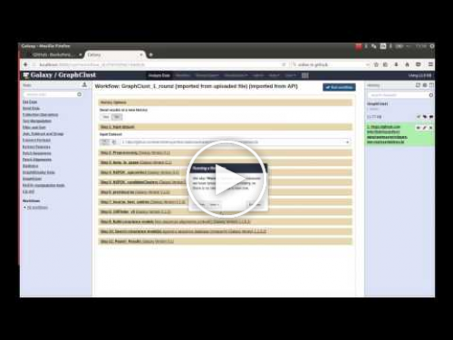

[](https://zenodo.org/badge/latestdoi/76652676)
[](https://travis-ci.org/BackofenLab/docker-galaxy-graphclust)
[](https://quay.io/repository/bgruening/galaxy-graphclust)

Galaxy-GraphClust
========================
Galaxy-GraphClust is a workflow for structural clustering of RNA secondary structures developed as an extension of [GraphClust](http://www.bioinf.uni-freiburg.de/Software/GraphClust) clustering pipeline ([Heyne et al.](https://www.ncbi.nlm.nih.gov/pmc/articles/PMC3371856)) inside the Galaxy framework. It consists of a set of integrated Galaxy tools and different flavors of clustering workflows built upon these tools.

:whale: Galaxy-GraphClust Docker Image
========================
This Docker image is a flavor of [Galaxy Docker image](https://github.com/bgruening/docker-galaxy-stable) customized by integrating Galaxy-GraphClust tools and workflows.

Table of Contents
=================
 
   * [Installation and Setup:](#installation-and-setup)
      * [Requirements:](#requirements)
      * [Running the Galaxy server](#running-the-galaxy-server)
         * [From the command line (Linux/Windows/MacOS):](#from-the-command-line-linuxwindowsmacos)
         * [Using Kitematic graphic interface (Windows/MacOS):](#using-kitematic-graphic-interface-windowsmacos)
   * [Usage - How to run Galaxy-GraphClust:](#usage---how-to-run-galaxy-graphclust)
      * [Browser access to the server:](#browser-access-to-the-server)
      * [Registration and Login:](#registration-and-login)
      * [Help](#help)
         * [Interactive tours](#interactive-tours)
         * [Video tutorial](#video-tutorial)
   * [GraphClust pipeline overview](#graphclust-pipeline-overview)
   * [Contributors](#contributors)
   * [Support &amp; Bug Reports](#support--bug-reports)


# Installation and Setup:
## Requirements:

The only requirement to run this Webserver locally is [Docker](https://docs.docker.com/installation).
Docker supports the three major desktop operating systems  Linux, Windows and Mac OSX. Please refer to Docker [installation guideline](https://docs.docker.com/installation) for details.

  * For Windows and Mac systems it is additinally possible
    to use [Kitematic](https://kitematic.com) and launch
    Galaxy GraphClust Flavor from the OS graphical user interface.

  * Alternative to launching our Docker container, having admin access
    to any Galaxy instance will enable you to install all needed tools to run the 
    GraphClust pipeline. All tools are listed in 
    [`graphclust.yml`](https://github.com/BackofenLab/docker-galaxy-graphclust/blob/master/graphclust.yml).
    The [Freibuger Galaxy Instance](http://galaxy.uni-freiburg.de) for example
    offers next to 700 other tools also the GraphClust Pipeline.


## Running the Galaxy server
### From the command line (Linux/Windows/MacOS):

```bash
docker run -i -t -p 8080:80 backofenlab/docker-galaxy-graphclust
```

For more details about this command line or specific usage, please consult the
[`README`](https://github.com/bgruening/docker-galaxy-stable/blob/master/README.md) of the main Galaxy Docker image, on which the current image is based.

### Using Kitematic graphic interface (Windows/MacOS):
Please check this [step-by-step guide](./kitematic/kitematic.md).

# Usage - How to run Galaxy-GraphClust:

## Browser access to the server:
After running the Galaxy server, a web server is established under the host IP/URL and designated port.

* Inside your browser goto IP/URL:PORT
* Following same settings as previous step

  * In the **same local computer**: [http://localhost:8080/](http://localhost:8080)
  * In **any computer with network connection to the host**: [http://HOSTIP:8080]()
    
## Registration and Login: 
To have distinct history and workflows the Galaxy server requires each user to register for first access time. **By default anyone with access to the host network can register. No registration confirmation email will be sent to the given email.** So you can register with any custom (including non-existent) email address. There exist also a default Admin user [described here](https://bgruening.github.io/docker-galaxy-stable/users-passwords.html).  To change the default authorization settings please refer to the Galaxy Wiki section [Authentication](https://wiki.galaxyproject.org/Develop/Authentication) 

* To register (first time only):
    * On top right of the panel goto **User→Register**
    * Provide a custom email address and password, confirm your password and enter a public name

* To login:
    * On top right of the panel goto **User→Login**
    * Provide your registered email address and password

## Help
### Interactive tours
Interactive Tours are available for Galaxy and Galaxy-GraphClust. To run the tours please on top panel go to **Help→Interactive Tours** and click on one of the tours prefixed **GraphClust workflow**. You can check the other tours for a more general introduction to the Galaxy interface.

### Video tutorial
You can check this Youtube video on setting-up and running Galaxy-GraphClust.

https://www.youtube.com/watch?v=fJ6tUt_6uas

[](https://www.youtube.com/watch?v=fJ6tUt_6uas)


GraphClust pipeline overview
===============================

GraphClust pipeline for clustering similar RNA sequences together is a complex pipeline, for deatils please check GraphClust publication. Overall it consists of three major phases: a) sequence based pre-clustering b) encoding predicted RNA structurs as graph features c) iterative fast candidate clustering then refinement


*GraphClust pipeline overview (Heyne et al. 2012)*

Below is the correspondance list of Galaxy-GraphClust tool names with each step of GraphClust:

<!--   a) sequence based pre-clustering:
b) encoding predicted RNA structures as graph features
  c) iterative fast candidate clustering then refinement
 --> 
|   Stage  | Galaxy Tool Name | Description|   
| :--------------------: | :--------------- | :----------------|
|1 | Preprocessing | Input preprocessing (fragmentation)|    
|2 | fasta_gspan | Generation of structures via RNAshapes and conversion into graphs|
|3 | NSPDK_sparseVect  | Generation of graph features via NSPDK |
|4| NSPDK_candidateClusters | min-hash based clustering of all feature vectors, output top dense candidate clusters|
|5| premLocarana,locarana_best_subtree, CMfinder | Locarna based clustering of each candidate cluster, all-vs-all pairwise alignments, create multiple alignments along guide tree, select best subtree,|
|6|  Build_covariance_models |  create candidate model |
|7| Search_covariance_models | Scan full input sequences with Infernal's cmsearch to find missing cluster members |
|8,9| Report results | Collect final clusters and create example alignments of top cluster members|

### Input data:
The input to the workflow is a set of putative RNA sequences in FASTA format. Inside the `sample_data` directory you can find examples of the input format. In this case the data is from a benchmark set based on Rfam 12.0 and additionally is optionally labeled with reference Rfam family members.

### Output:
The output contains the predicted clusters, where similar putative input RNA sequences form a cluster. Additionally overall status of the clusters and the matching of cluster elements is reported for each cluster. Please check the interactive tours and GraphClust [README](http://www.bioinf.uni-freiburg.de/Software/GraphClust/README) for more information about the reported info and files.

# Contributors

 - [Milad Miladi](https://github.com/mmiladi/)
 - [Eteri Sokhoyan](https://github.com/eteriSokhoyan)
 - [Bjoern Gruening](https://github.com/bgruening)


# Support & Bug Reports

You can file an [github issue](https://github.com/BackofenLab/docker-galaxy-graphclust/issues) or ask us on the [Galaxy development list](http://lists.bx.psu.edu/listinfo/galaxy-dev).

# Publications
[M. Miladi, E. Sokhoyan, F. Costa, R. Backofen and B. Gruening, Galaxy-GraphClust: scalable and accessible clustering of ncRNAs based on secondary structures, (submitted)]

[S. Heyne, F. Costa, D. Rose, R. Backofen, GraphClust: alignment-free structural clustering of local RNA secondary structures, Bioinformatics, 2012]
