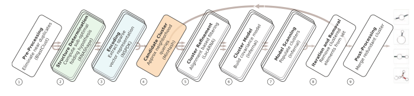
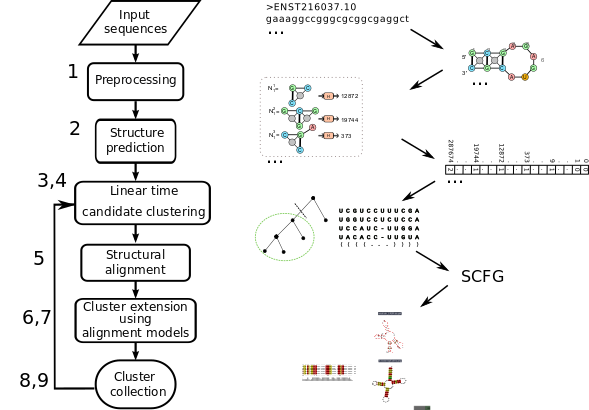

[](https://zenodo.org/badge/latestdoi/76652676)
[](https://travis-ci.org/BackofenLab/GraphClust-2)
[](https://hub.docker.com/r/backofenlab/docker-galaxy-graphclust)
<!-- [](https://quay.io/repository/bgruening/galaxy-graphclust)
 -->
 
 
GraphClust2
========================
GraphClust2 is a  workflow for structural clustering of RNA secondary structures developed in inside the Galaxy framework. It consists of a set of integrated Galaxy tools and different flavors of clustering workflows built upon these tools.

:whale: GraphClust2 Docker Image
========================
This Docker image is a flavor of [Galaxy Docker image](https://github.com/bgruening/docker-galaxy-stable) customized by integrating GraphClust2 tools and workflows.

Table of Contents
=================
 
   * [Installation and Setup](#installation-and-setup)
      * [Requirements](#requirements)
      * [Running the Galaxy server](#running-the-galaxy-server)
         * [From the command line (Linux/Windows/MacOS)](#from-the-command-line-linuxwindowsmacos)
         * [Using Kitematic graphic interface (Windows/MacOS)](#using-kitematic-graphic-interface-windowsmacos)
   * [Usage - How to run GraphClust2](#usage---how-to-run-GraphClust2)
      * [Browser access to the server](#browser-access-to-the-server)
      * [Registration and Login](#registration-and-login)
      * [Help](#help)
         * [Interactive tours](#interactive-tours)
         * [Video tutorial](#video-tutorial)
   * [GraphClust pipeline overview](#graphclust-pipeline-overview)
   * [Contributors](#contributors)
   * [Support &amp; Bug Reports](#support--bug-reports)


# Installation and Setup:
## Requirements:

The only requirement to run this webserver locally is [Docker](https://docs.docker.com/installation).
Docker supports the three major desktop operating systems  Linux, Windows and Mac OSX. Please refer to Docker [installation guideline](https://docs.docker.com/installation) for details.

  * For Windows and Mac systems it is additionally possible
    to use [Kitematic](./kitematic/kitematic.md) and launch
    Galaxy GraphClust using the OS graphical user interface.

  * Alternatively GraphClust2 can be integrated into a running Galaxy server. All the GraphClust2 tools and workflows needed to run the 
    GraphClust pipeline are listed in [workflows](./workflows/) and 
    [tools-list](graphclust.yml).
    The [Freibug Galaxy Instance](http://galaxy.uni-freiburg.de) for example
    offers next to 700 other tools also the GraphClust Pipeline.


## Running the Galaxy server
#### From the command line (Linux/Windows/MacOS):

```bash
docker run -i -t -p 8080:80 backofenlab/docker-galaxy-graphclust
```

For more details about this command line or specific usage, please consult the Galaxy Docker [`guide`](https://github.com/bgruening/docker-galaxy-stable/blob/master/README.md).

#### Using graphic interface (Windows/MacOS):
Please check this [step-by-step guide](./kitematic/kitematic.md).

### Demo instance:
A running demo instance of GraphClust2 is available at http://192.52.32.222:8080/.
Please note this instance is exactly the same Docker container which we offer here. It has limited computation 
capacity and intended for demonstration and testing purposes. Currently it is not planned to have a long-time availability. We recommend to follow instructions above.

#### Setup support:
In case you encountered problems please use the recommended settings, check the [FAQs](./FAQ.md) or contact us via [*Issues*](https://github.com/BackofenLab/GraphClust-2/issues) section of the repository.

#### Recommended settings:
**GraphClust2 has been tested One of these operating systems:**
* *Windows* : 10 using [Kitematic](https://kitematic.com/)
* *MacOSx*: 10.1x or higher using [Kitematic](https://kitematic.com/)
* *Linux*: Kernel 4.2 or higher, preferably with aufs support (see [FAQ](FAQ.md))

**Hardware:**
* Minimum 8GB memory
* Minimum 20GB free disk storage space


#### Setup support:
In case you encountered problems please check the [FAQ page](./FAQ.md) or contact us using Issues tab.

# Usage - How to run GraphClust2:

## Browser access to the server:
After running the Galaxy server, a web server is established under the host IP/URL and designated port (default 8080).

* Inside your browser goto IP/URL:PORT
* Following same settings as previous step

  * In the **same local computer**: [http://localhost:8080/](http://localhost:8080)
  * In **any computer with network connection to the host**: [http://HOSTIP:8080]()

## Help

### Video tutorial
[This video tutorial](https://www.youtube.com/watch?v=fJ6tUt_6uas) can be helpful to get a visually comprehensive introduction on setting-up and running GraphClust2.


[](https://www.youtube.com/watch?v=fJ6tUt_6uas)

### Interactive tours
Interactive Tours are available for Galaxy and GraphClust2. To run the tours please on top panel go to **Help→Interactive Tours** and click on one of the tours prefixed **GraphClust workflow**. You can check the other tours for a more general introduction to the Galaxy interface.

### Import or upload a workflow

To import or upload an existing workflow, on the top panel go to **Workflow** menu. On top right side of the screen click on **Upload or import workflow** button. You can either upload workflow from your local system or by providing the URL of the workflow. To have an access to workflow menu you must be logged in. You can download workflows from the following links 

#### Workflows files:
  * MotifFinder : [GraphClust-MotifFinder](https://raw.githubusercontent.com/BackofenLab/GraphClust-2/master/workflows/GraphClust-MotifFinder.ga)
  * Workflow main : [GraphClust_main_1r](https://raw.githubusercontent.com/BackofenLab/GraphClust-2/master/workflows/GraphClust_main_1r.ga)
  * Additonal variations: [extra-workflows](./workflows/extra-workflows/README.md)


#### [Frequently Asked Questions](FAQ.md) 

Workflow overview
===============================

GraphClust pipeline for clustering similar RNA sequences together is a multi-step rather complex pipeline. Overall it consists of three major phases: a) sequence based pre-clustering b) encoding predicted RNA structures as graph features c) iterative fast candidate clustering then refinement

<!-- 

*GraphClust pipeline overview (Heyne et al. 2012)*
 -->
 

Below is a coarse-grained correspondence list of GraphClust2 tool names with each step:

|   Stage  | Galaxy Tool Name | Description|
| :--------------------: | :--------------- | :----------------|
|1 | [Preprocessing](https://graphclust.usegalaxy.eu/root?tool_id=toolshed.g2.bx.psu.edu/repos/rnateam/graphclust_preprocessing/preproc/0.5) | Input preprocessing (fragmentation)|
|2 | [fasta_to_gspan](https://graphclust.usegalaxy.eu/root?tool_id=toolshed.g2.bx.psu.edu/repos/rnateam/graphclust_fasta_to_gspan/gspan/0.4) | Generation of structures via RNAshapes and conversion into graphs|
|3 | [NSPDK_sparseVect](https://graphclust.usegalaxy.eu/root?tool_id=toolshed.g2.bx.psu.edu/repos/rnateam/graphclust_nspdk/nspdk_sparse/9.2.3) | Generation of graph features via NSPDK |
|4| [NSPDK_candidateClusters](https://graphclust.usegalaxy.eu/root?tool_id=toolshed.g2.bx.psu.edu/repos/rnateam/graphclust_nspdk/NSPDK_candidateClust/9.2.3) | min-hash based clustering of all feature vectors, output top dense candidate clusters|
|5| [PGMA_locarna](https://graphclust.usegalaxy.eu/?tool_id=toolshed.g2.bx.psu.edu/repos/rnateam/graphclust_prepocessing_for_mlocarna/preMloc/0.4),[locarna](https://graphclust.usegalaxy.eu/tool_runner?tool_id=toolshed.g2.bx.psu.edu/repos/rnateam/graphclust_mlocarna/locarna_best_subtree/0.4), [CMfinder](https://graphclust.usegalaxy.eu/?tool_id=toolshed.g2.bx.psu.edu/repos/rnateam/graphclust_cmfinder/cmFinder/0.4) | Locarna based clustering of each candidate cluster, all-vs-all pairwise alignments, create multiple alignments along guide tree, select best subtree, and refine alignment.|
|6| [Build covariance models](https://graphclust.usegalaxy.eu/root?tool_id=toolshed.g2.bx.psu.edu/repos/bgruening/infernal/infernal_cmbuild/1.1.0.2) |  create candidate model |
|7| [Search covariance models](https://graphclust.usegalaxy.eu/root?tool_id=toolshed.g2.bx.psu.edu/repos/bgruening/infernal/infernal_cmsearch/1.1.0.2) | Scan full input sequences with Infernal's cmsearch to find missing cluster members |
|8,9| [Report results](https://graphclust.usegalaxy.eu/?tool_id=toolshed.g2.bx.psu.edu/repos/rnateam/graphclust_postprocessing/glob_report/0.5) and [conservation evaluations](https://graphclust.usegalaxy.eu/?tool_id=toolshed.g2.bx.psu.edu/repos/rnateam%2Fgraphclust_aggregate_alignments/graphclust_aggregate_alignments/0.1) | Collect final clusters and create example alignments of top cluster members|


### Input:
The input to the workflow is a set of putative RNA sequences in FASTA format. Inside the `sample_data` directory you can find examples of the input format. In this case the data is from a benchmark set based on Rfam 12.0 and additionally is optionally labeled with reference Rfam family members.

### Configuring the workflows:
Please proceed with the interactive tour named `GraphClust workflow step by step`, available under `Help->Interactive Tours`
Check FAQs for understanding the frequently important parameters. 

### Output:
The output contains the predicted clusters, where similar putative input RNA sequences form a cluster. Additionally overall status of the clusters and the matching of cluster elements is reported for each cluster. 

Please check the interactive tours and GraphClust [README](http://www.bioinf.uni-freiburg.de/Software/GraphClust/README) for more information about the reported info and files.

<!-- # Contributors

 - [Milad Miladi](https://github.com/mmiladi/)
 - [Eteri Sokhoyan](https://github.com/eteriSokhoyan)
 - [Bjoern Gruening](https://github.com/bgruening)
 -->

# Support & Bug Reports

You can file an [github issue](https://github.com/BackofenLab/GraphClust-2/issues) or ask us on the [Galaxy development list](http://lists.bx.psu.edu/listinfo/galaxy-dev).

# Publications
[M. Miladi, E. Sokhoyan, T. Houwaart, S. Heyne, F. Costa, R. Backofen and B. Gruening; Empowering the annotation and discovery of structured RNAs with scalable and accessible integrative clustering (under preparation/revision)]
