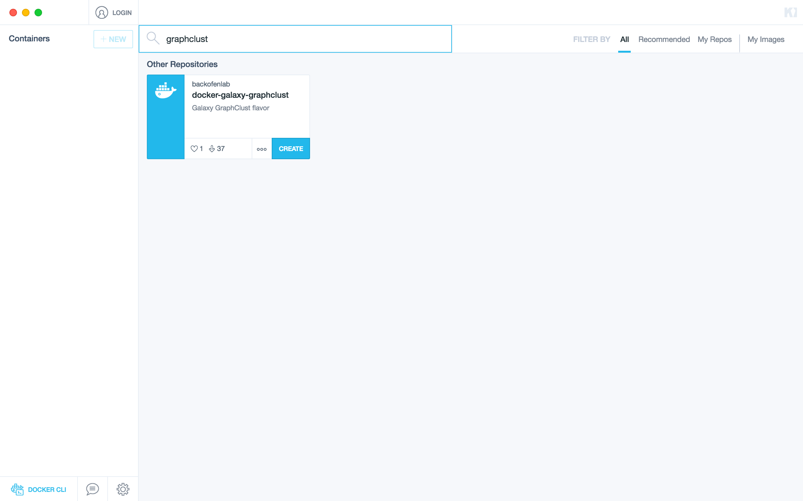
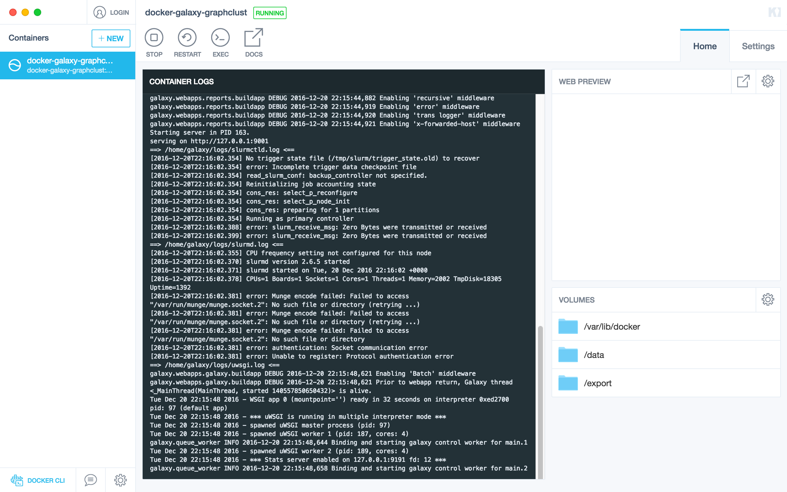
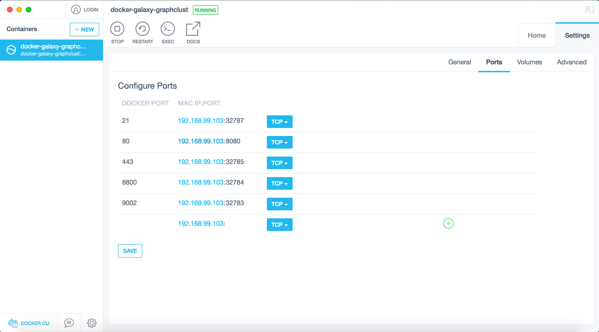
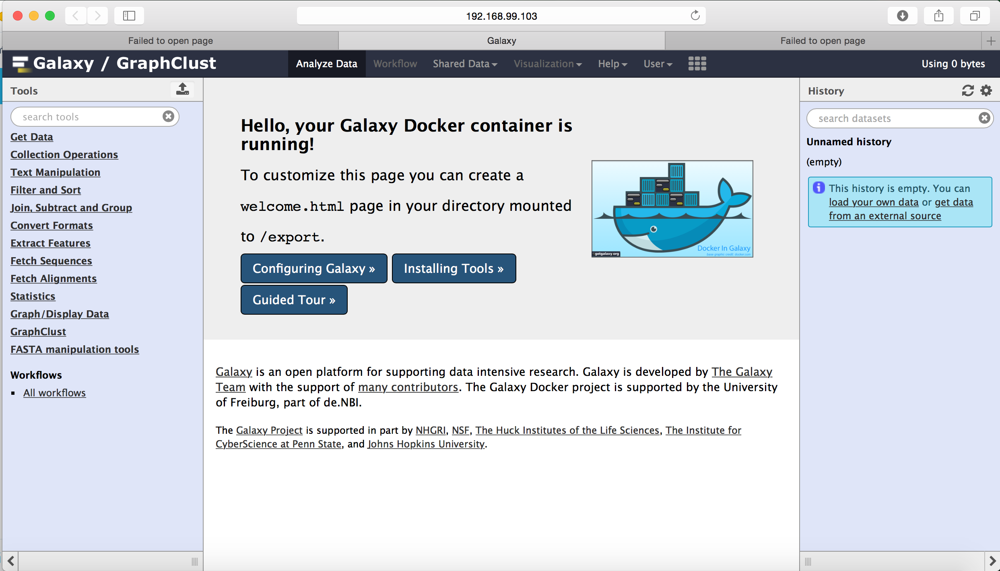

[](https://zenodo.org/badge/latestdoi/5466/bgruening/docker-galaxy-stable)
[](https://travis-ci.org/BackofenLab/docker-galaxy-graphclust)
[](https://quay.io/repository/bgruening/galaxy-graphclust)

Galaxy GraphClust Flavor
========================

:whale: Galaxy Docker repository for GraphClust

# Requirements:

 - [Docker](https://docs.docker.com/installation/)
   A Docker client with the necessary user permissions is required for running the Galaxy GraphClust. Docker supports the three major desktop operating systems  Linux, Windows and Mac OSX. Please refer to Docker [installation guideline](https://docs.docker.com/installation/) for details.

- For Windows and Mac systems it is additinally possible to use [Kitematic](https://kitematic.com/) and launch Galaxy GraphClust Flavor from the OS graphical user interface.

- Alternative to launch the docker, having access to a Galaxy instance server preconfigured with the set of tools included in 'graphclust.yml' would be enough to run GraphClust Galaxy pipeline. (TODO: clarify this option) (TODO: mention Freiburg galaxy server?)

# Setup:

## From the command line (Linux/Windows/MacOS):

```
docker run -i -t -p 8080:80 backofenlab/docker-galaxy-graphclust
```

For more details about this command line or specific usage, please consult the
[`README`](https://github.com/bgruening/docker-galaxy-stable/blob/master/README.md) of the main Galaxy Docker image, on which the current image is based.

## Using Kitematic graphic interface(Windows/MacOS):
1. Run kitematic,  search for `graphclust` and click on `create` button

2. Wait for image to be downloaded

3. Galaxy instance starts loading, wait for message `Binding and starting galaxy control worker for main` 

4. Inside Kitematic, go to teh `settings` tab then `ports`. Configure Docker port `80` to bind on host port `8080`. Save the setting and click on binded IP for port `8080`.

5. Start browsing Galaxy html interface on `IP:8080`



# Usage:

## To launch the Galaxy GraphClust pipeline:

### From command line:
* Inside your browser goto [http://localhost:8080/](http://localhost:8080/)


# Contributers

 - Milad Miladi
 - Eteri Sokhoyan
 - Bjoern Gruening


# History

 - 0.1: Initial release!


# Support & Bug Reports

You can file an [github issue](https://github.com/BackofenLab/docker-galaxy-graphclust/issues) or ask us on the [Galaxy development list](http://lists.bx.psu.edu/listinfo/galaxy-dev).
