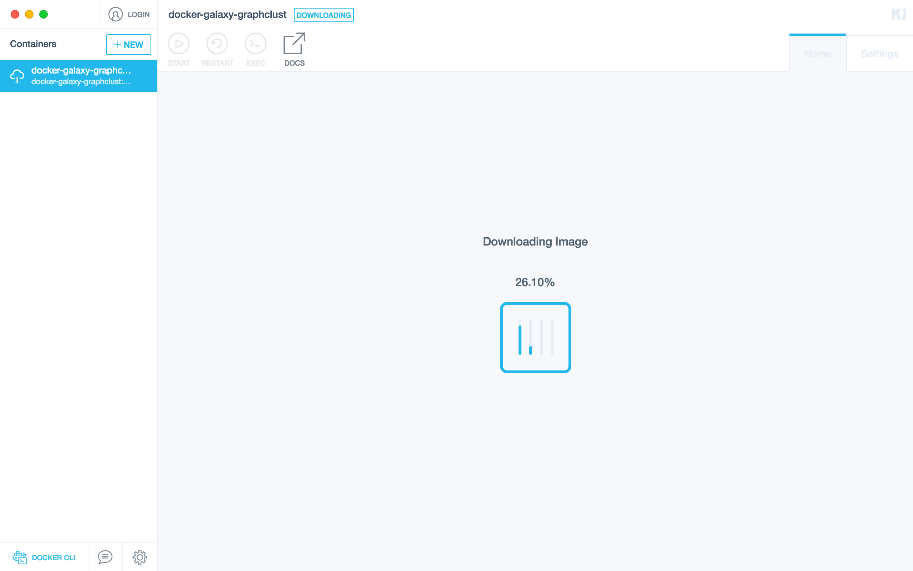

### Galaxy-GraphClust
## Step-by-step setup guide with Kitematic (Windows/MacOS):  ##

0. Obtain and install Kitematic from https://kitematic.com/

1. For detailed info you may check [Kitematic guide](https://docs.docker.com/kitematic/userguide/#docker-command-line-access)

1. Run kitematic,  search for `graphclust` and click on `create` button

2. Wait for image to be downloaded. With the first time run this step may take few minutes. 

3. Galaxy instance starts loading, wait for message `Binding and starting galaxy control worker for main` 

4. Inside Kitematic, go to teh `settings` tab then `ports`. Configure Docker port `80` to bind on host port `8080`. Save the setting and click on binded IP for port `8080`.

5. Start browsing Galaxy html interface on `IP:8080`

